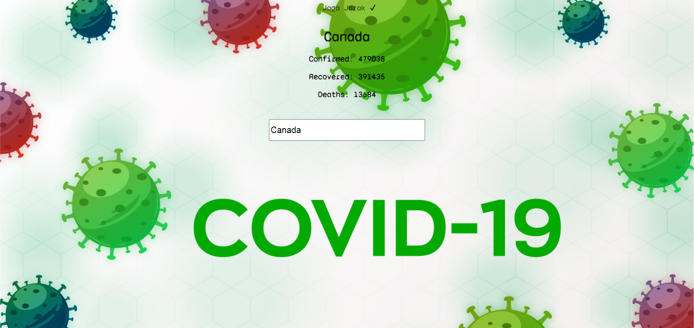

# covid19-search
> _This project was bootstrapped with Create React App._

## What The Project Does 
- Know the number of **Confirmed**, **Deaths**, and **Recovered** from Covid 19 in several countries.
- Simple App.

Screenshoot :rainbow: 


## Techs
- React
- [Axios](https://www.npmjs.com/package/axios/ "NPM Axios")

## Install
```
npm install
```

## :rocket: Deploy
https://create-react-app.dev/docs/deployment/#github-pages

## Links
- Demo [_Here_...](https://xvferdy.github.io/covid19-search/ "Github Pages")
- Playground [_Here_...](https://codesandbox.io/s/github/xvferdy/covid19-search/tree/main/ "Codesandbox")

